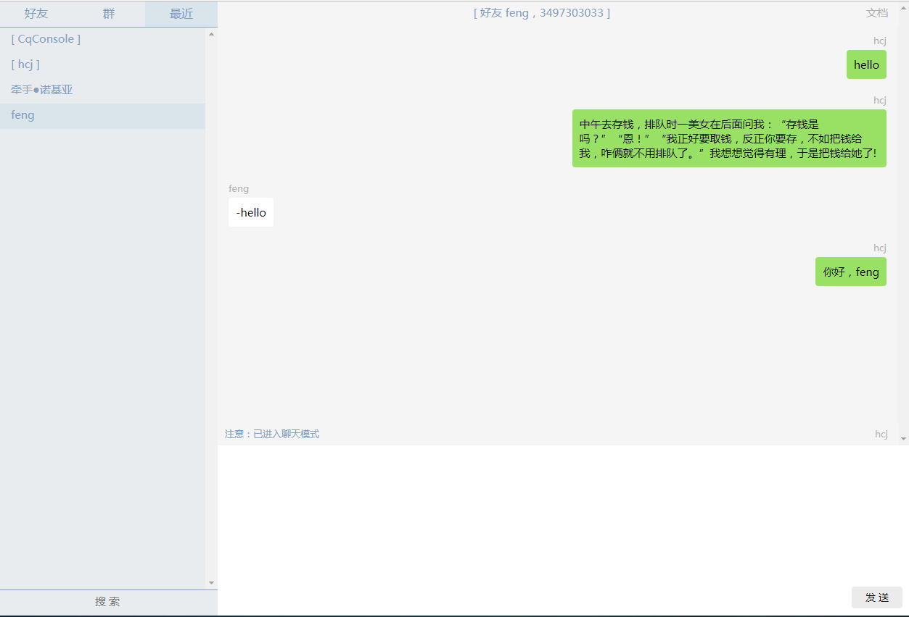

一、介绍
---------

[js-bot](https://pandolia.net/js-bot) 是一个基于 [酷 Q](https://cqp.cc/) Websocket 服务（[CoolQ HTTP API 插件](https://github.com/richardchien/coolq-http-api)）的浏览器端聊天机器人框架及开发工具，用 Typescript + React 开发，你可以在“聊天模式”下与好友/群聊天，也可以在其 “控制台模式” 下输入 Javascript 代码运行或调用 js-bot 及 coolq-http 提供的 api ，并注册消息等事件的响应函数来实现自己的机器人，还可以在“虚拟聊天模式”下用虚拟账号向机器人发送消息来测试自己编写的机器人，所有这一切都可以在 https://pandolia.net/js-bot 这一个网页上进行。

js-bot 控制台模式效果如下：


聊天模式效果如下：



二、系统需求
------------

* Chrome 或 Firefox 浏览器
* [酷 Q](https://cqp.cc/) 及 [CoolQ HTTP API 插件](https://github.com/richardchien/coolq-http-api)

用酷 Q 登录账号后，启用 cqhttp 插件，之后退出酷 Q ，找到 “data\app\io.github.richardchien.coolqhttpapi\config” 下相应账号的配置文件，将 websocket 相关的配置修改如下：

```json
{
    "use_ws": true,
    "ws_host": "127.0.0.1",
    "ws_port": 6700,
    "access_token": "mytoken",
}

```

再次登录，等酷 Q Websocket 服务启动后，用浏览器打开 https://pandolia.net/js-bot 网址，就可以使用 js-bot 尽情的玩耍了，此时用其他账号给本账号发送 "-joke"，本账号会自动回复一则笑话。

如果酷 Q Websocket 服务是在其他机器上部署的，可以在 url 参数中指定其地址及 token ，例如：https://pandolia.net/js-bot/?ws_host=192.168.111.111:6700&token=mytoken 。

对于 IE/Edge ，由于浏览器默认禁止 Javascript 代码连接不同主机的 WebSocket 服务，解决方案为：Internet选项 -> 安全 -> 本地Internet -> 站点，把所有勾选取消。或者下载本项目代码，build 之后将 html 文件部署在本地再访问。

如果不开启酷 Q Websocket 服务， js-bot 的 “控制台模式” 和 “虚拟聊天” 模式仍然是可以使用的，但与 QQ 相关的功能全都不可用。

三、控制台模式
---------------

控制台模式下，可以直接在输入框输入 Javascript 代码运行，例如：

```
// 打印文本
>>> print('hello')
hello

// 查找账号为 3497303033 的好友
>>> buddies.get('3497303033')
[ 好友 feng，3497303033 ]

// ans 中保存上一次命令的运行结果
>>> ans
[ 好友 feng，3497303033 ]

// 向好友发送消息 "hello"
>>> ans.send('hello')
null

// 调用 ai.joke() 生成一个笑话
// 注意： ai.joke() 返回的是一个 Promise 对象，js-bot 解释器会等待其 fullfilled ，将结果保存到 ans 中再返回
>>> ai.joke()
中午去存钱，排队时一美女在后面问我：“存钱是吗？”“恩！”“我正好要取钱，反正你要存，不如把钱给我，咋俩就不用排队了。”
我想想觉得有理，于是把钱给她了!

// 向好友发送笑话
>>> buddies.get('3497303033').send(ans)
null
```

控制台模式下，使用 js-bot 提供的内部变量和方法：

* buddies： 好友列表，ContactTable 对象，具有 type/name/length 属性及 get/map/forEach/filter/find 方法
* groups: 群列表，ContactTable 对象
* ans: 上一次命令的运行结果
* print/clr/debug/info/warn/error: 打印、清屏及日志方法
* showModal/popMoal: 显示信息框，例如： showModal("xxx")
* BUDDY/GROUP/NOTYPE/CONSOLE/MYSELF/VIRTUAL_BUDDY: 常量，表示联系人的类型
* handler.onMessage/handler.onCqEvent: 消息事件及其他事件的响应函数，可以改写这两个属性

buddies/groups 中保存的是 Contact 对象，具有 type/qq/name 属性和 send 方法，type 为 BUDDY 表示好友，GROUP 表示群，另外 VIRTUAL_BUDDY 表示虚拟好友。

在控制台模式下运行代码，与在浏览器自带的开发者工具的 Devtool-Console 中运行代码，有两点不一样：

* 1） 以上所述的 js-bot 提供的变量，在 Devtool-Console 中是不可见的，需要加 **cq.** 才能访问，例如： **cq.buddies**
* 2） 控制台模式下，如果命令返回的是一个 Promise 对象，js-bot 解释器会等待其 fullfilled 再返回，而 Devtool-Console 则不会，例如，对于 ai.joke() ，在 Devtool-Console 下如果需要打印其返回结果，则应这样调用： **cq.ai.joke().then(function (t) { console.log(t) })**

对于第二点，要注意的是，即便是在控制台模式下，也不能将 ai.joke() 的结果直接传递给 send 方法，而应该这样调用： **ai.joke().then(function (t) { buddies.get('3497303033').send(t) })**

可以在控制台模式下对 handler.onMessage 和 handler.onCqEvent 进行重新赋值，从而实现自己的聊天机器人，例如：

```
>>>
handler.onMessage = function (contact, message) {
    if (message.content === '-hello') {
        contact.send('你好，' + contact.name)
            .then(function() {
                popModal('发消息成功');
            });
    }
}
```

在控制台中运行以上代码后，当 **本账号** 收到内容为 **"-hello"** 的消息时，会自动回复： **"你好，xx"** 。


四、虚拟聊天模式
---------------

为了测试自己开发的机器人程序，需要利用其它账号向本账号发送消息，这显然很不方便，因此 js-bot 提供 **虚拟聊天模式** 来快速测试。

在 js-bot 中的 **最近** 联系人列表内，点击第二个联系人 **[ yourname ]** ，就进入了虚拟聊天模式，此时，用户扮演 **虚拟好友** 向本账号发送消息。在此模式下输入文本并发送时，机器人会收到一条来自 **虚拟好友** 的消息， handler.onMessage 同样会被调用，此时，contact 的 type 属性为 cq.VIRTUAL_BUDDY , name 属性为 **"虚拟好友"** 。

例如，对于上一节的 onMessage 函数，在 **虚拟聊天** 模式下发送 "-hello" ，则机器人会自动回复 "你好，虚拟好友" 。

五、普通聊天模式
-----------------

如果 js-bot 已连接了酷 Q 的 Websocket 服务，那么 js-bot 的普通聊天模式是可用的，可以在页面上点击好友和群，然后进行聊天。

当进入到普通聊天模式时， js-bot 会将页面上的输入框上方的模式信息文本颜色调得更加明显，提醒用户已进入聊天模式，避免发送无关的信息。

如果没有开启酷 Q 的 Websocket 服务，普通聊天模式无法使用，但控制台模式和虚拟聊天模式仍然是可用的。

六、开发模式
------------------

本项目采用 Typescript + React 开发，可以下载本项目源码，运行 npm install 和 npm start 启动本项目，并按自己的需要进行开发和扩展。建议采用 Vs Code （需要安装 Eslint 和 Tslint 插件）。

开发和扩展 js-bot 时，修改 src/myhandler-ts.ts 文件就可以了，在此文件中导出两个事件函数：

```typescript
import Contact from './cq/Contact';
import cq from './cq';

export default {
    onMessage: async (contact: Contact, message: IMessage) => {
        if (message.content !== '-joke') {
            return;
        }

        const joke = await cq.ai.joke();
        await contact.send(joke);
        cq.popModal('发送笑话成功.');
    },

    onCqEvent: async (data: any) => {
        return;
    },
};
```

如果不会 Typescript ，也可以用 Javascript 开发，修改 src/myhandler-js.js 文件就可以了，需要在 src/index.tsx 文件中改为：**import handler from './myhandler.js'** 。

本项目中的其他文件，建议不要修改，如果确实需要修改，请在 [项目 github 主页](https://github.com/pandolia/js-bot) 上发 issue 或 pull-request 。

好友消息和群消息之外的其他事件会被传递给 onCqEvent 函数，支持的事件列表及各事件的字段说明详见 [cqhttp 事件列表](https://cqhttp.cc/docs/4.12/#/Post?id=%E4%BA%8B%E4%BB%B6%E5%88%97%E8%A1%A8) 。

在事件函数中，除了发送消息，也可以用 cq.api 方法调用 cqhttp 提供的 api （例如：发送好友赞等），示例如下：

```typescript
await cq.api('send_like', { user_id: 158297369 });
```

其他 cqhttp-api 见 [cqhttp API 列表](https://cqhttp.cc/docs/4.12/#/API?id=api-%E5%88%97%E8%A1%A8) ，调用时需注意下面两个问题：

* 第一个参数为 cqhttp-api 名称，前面不含斜杠 "/"
* 第二个参数为 cqhttp-api 参数，与用户 id 相关的字段全部采用 number 类型（js-bot 内部采用的是 string 类型）

七、 js-bot API
-------------------

以下列出 js-bot 内部可使用的常量、变量和方法，禁止直接修改变量，只能通过调用方法来改变 js-bot 的内部状态。

#### 1. 常量（src/cq/CqStore.tsx）

```typescript
// 联系人类型： 好友/群/无/控制台/自己/虚拟好友
export const BUDDY = 0;
export const GROUP = 1;
export const NOTYPE = 2;
export const CONSOLE = 3;
export const MYSELF = 4;
export const VIRTUAL_BUDDY = 5;

// 消息方向，LEFT 代表消息画在左边，RIGHT 代表消息画在右边
export const LEFT = 0;
export const RIGHT = 1;

// 日志级别
export const DEBUG = 0;
export const INFO = 1;
export const WARN = 2;
export const ERROR = 3;

// 每个联系人保存的消息总数最大值
export const MAX_MESSAGES_SIZE = 400;

// 环境（在 .env 文件内定义），项目名称， CQ-WEBSOCKET 参数， github 地址
export const PROJECT_NAME: string;
export const DEFAULT_WS_HOST: string;
export const DEFAULT_TOKEN: string;
export const DEFAULT_RECENTS: string;
export const GITHUB_URL: string;
```

#### 2. 类型及接口（src/types.d.ts）

```typescript
// 消息方向 LEFT/RIGHT
type DirectionType = 0 | 1;

// 消息接口（ onMessage 的第二个参数为 IMessage 对象）
interface IMessage {
    readonly id: string;
    readonly direction: DirectionType;
    readonly from: string;
    readonly content: string;
}

// 联系人类型 BUDDY ~ VIRTUAL_BUDDY
type ContactType = 0 | 1 | 2 | 3 | 4 | 5;

// 日志级别 DEBUG ~ ERROR
type LogLevel = 0 | 1 | 2 | 3;

// 事件处理接口
interface IHandler {
    onMessage: (c: Contact, m: Message) => any,
    onCqEvent: (data: any) => any,
}
```

#### 3. Contact 类（src/cq/Contact.tsx）

```typescript
class Contact {

    // 类型 BUDDY/GROUP/VIRTUAL_BUDDY ，代表 好友/群/虚拟好友
    type: ContactType;
    
    // 账号
    qq: string;

    // 名称
    name: string;

    // 向本联系人发送消息，发送成功返回 null ，发送失败则抛出 Error 错误
    send = async (text: string): Promise<null> => { /* */ }

}
```

#### 4. ContactTable 类（src/cq/ContactTable）

```typescript
class ContactTable {

    // 类型 BUDDY/GROUP/NOTYPE 代表 好友列表/群列表/最近联系人列表
    type: ContactType;

    // 名称
    get name() { /* */ }

    // 分别以数组和字典保存所有联系人，请勿访问这两个属性
    _list: Contact[] = [];
    _dict: Map<string, Contact> = new Map();

    // 联系人个数
    get length() { return this._list.length; }

    // 遍历、查找联系人
    map = this._list.map.bind(this._list);
    forEach = this._list.forEach.bind(this._list);
    filter = this._list.filter.bind(this._list);
    find = this._list.find.bind(this._list);

    // 查询联系人
    // get('3497303033') 返回 qq 为 '3497303033' 的 Contact 对象
    // get(0) 返回第一个 Contact 对象
    // 对象不存在时返回 undefined
    get(qqOrIndex: string | number): Contact | undefined { /* */ }
}
```

#### 5. 全局 cq 对象（src/cq/CqStore.tsx）

```typescript
// 好友列表/群列表/最近联系人列表
export const buddies = new ContactTable(BUDDY);
export const groups = new ContactTable(GROUP);
export const recents = new ContactTable(NOTYPE);

// 事件处理对象
export let handler: IHandler;

// 控制台上次命令运行结果
export let ans;

// 打印、清屏
export function print(line = '') { /* */ }
export function clr() { /* */ }

// 日志
export let level: LogLevel;
export function setLogLevel(_level: LogLevel) { /* */ }
export function debug(_level: LogLevel, msg: any) { /* */ }
export function info(_level: LogLevel, msg: any) { /* */ }
export function warn(_level: LogLevel, msg: any) { /* */ }
export function error(_level: LogLevel, msg: any) { /* */ }

// 模态对话框
export async function showModal(msg: any) { /* */ } // 展示
export function closeModal() { /* */ } // 关闭
export function popModal(msg: any, t = 2500) { /* */ } // 展示，t 毫秒后关闭

// cqhttp 服务地址及 token
export const ws_host: string;
export const token: string;

// ai （见 src/ai/index.tsx 目前只有 ai.joke ）
export const ai;

// api
export function api(action: string, params: any = null): Promise<any> { /* */ }

// 退出并重启 js-bot
export function abort(msg: string) { /* */ }

// 重置 cqhttp 服务地址
export function reset(w = DEFAULT_WS_HOST, t = DEFAULT_TOKEN, r = DEFAULT_RECENTS) { /* */ }
```

八、特别致谢
--------------

感谢 Richard Chien 开发的强大的 [coolq-http-api](https://github.com/richardchien/coolq-http-api) 。